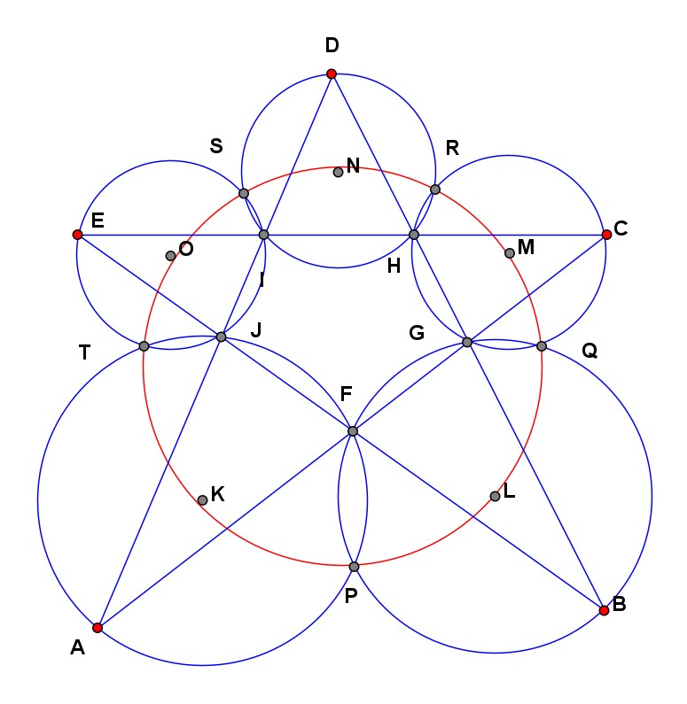
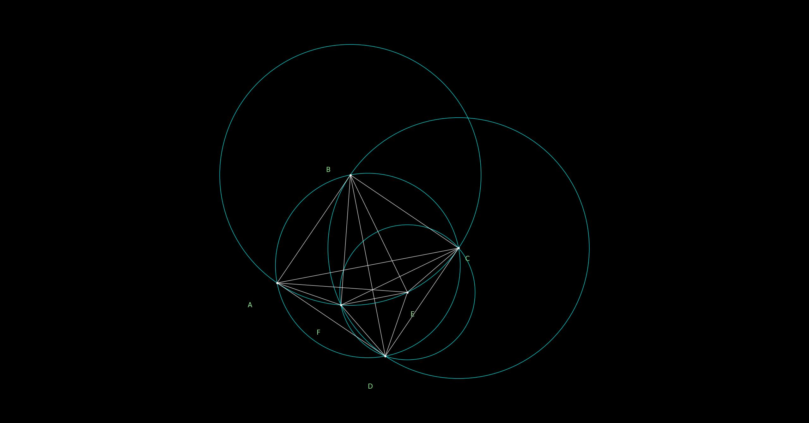
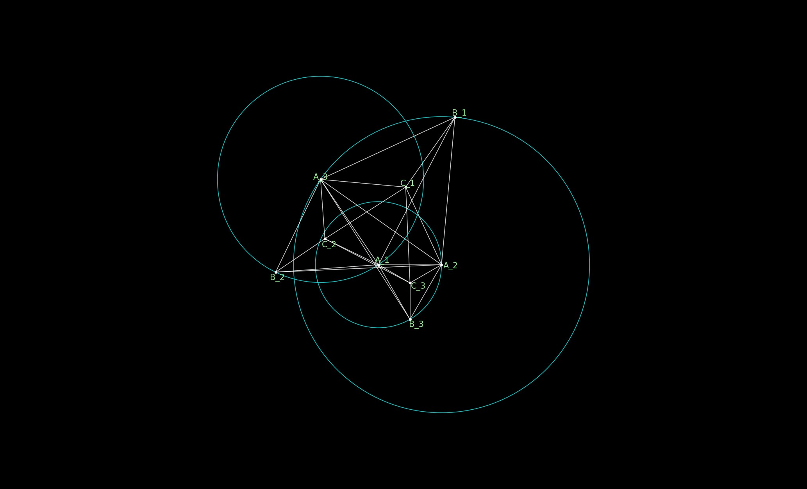
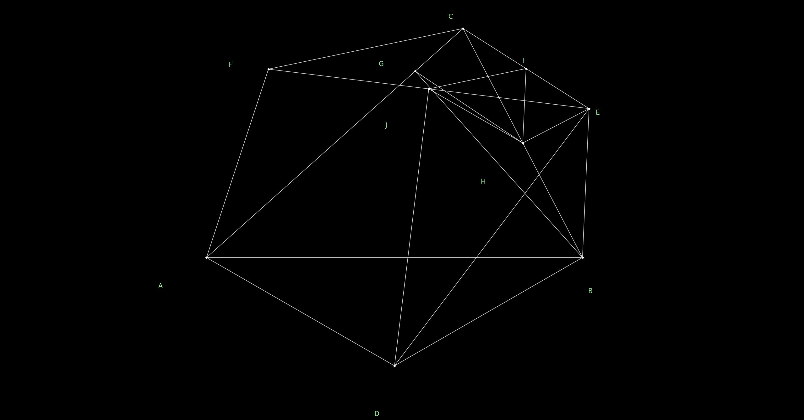
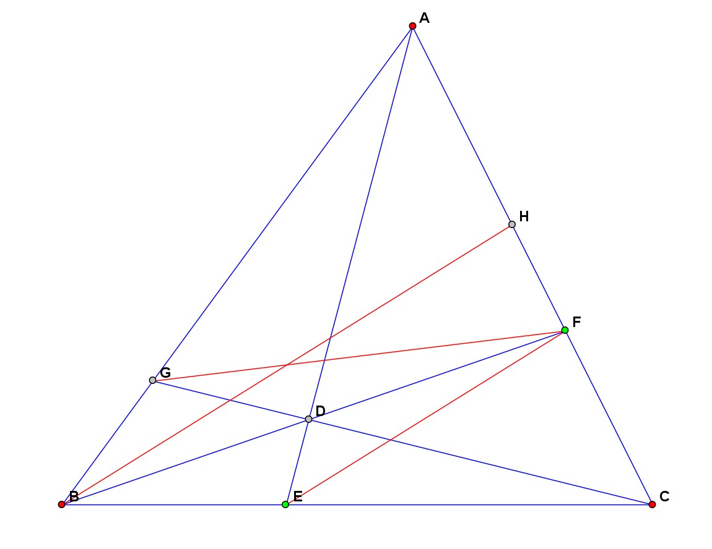

# AG4Masses: AlphaGeometry for the Masses

An exciting recent development in AI with rigorous logical reasoning ability is the [AlphaGeometry](https://www.nature.com/articles/s41586-023-06747-5) system developed by Google Deepmind. Google made the source code for running AlphaGeometry available on GitHub at [google-deepmind/alphageometry](https://github.com/google-deepmind/alphageometry). However, the AlphaGeometry system as Google released, with the Language Model trained by Google, still requires a tremendous amount of computing power to run when solving problems. As Google's paper mentioned, in order to solve IMO level problems in about 1.5 hour, it needed 4 GPU V100 and up to 250 CPUs. These are not the kind of hardware casual users and hobbyists have access to.

AlphaGeometry includes a powerful deductive engine DD+AR that can solve virtually any plane geometry problem that does not require auxiliary points within a few minutes with household hardware. The ultimate performance of the system hinges on the ability to add auxiliary points that lead to a solution. In AlphaGeometry, this is done by the Language Model. My tests shown that, for many classic problems, AlphaGeometry failed to solve them after trying more than ~8000 figures with added auxiliary points. For humans, the number of figures attempted is typically under 100. This indicates that there is still vast room to improve the performance of AlphaGeometry.

Since the initial open-sourcing in January 2024, as of April 2024, there has been no update to the AlphaGeometry repository. It is unclear whether Google plans to continue developing AlphaGeometry. The AG4Masses project is a fork of [google-deepmind/alphageometry](https://github.com/google-deepmind/alphageometry). I hope to build on the wonderful foundation AlphaGeometry has laid, continue to improve it, bring its powers to everyday users and hobbyists, and provide useful insights to future developments of AI with rigorous logical reasoning ability.

# The Goal of AG4Masses

The goal of this project is to **improve the performance of AlphaGeometry by a factor of ~100** to enable it to **solve IMO level (hence vast majority of) plane geometry problems with household hardware (as of 2024, 4-8 logical CPU, 16-32G RAM, no high-end GPU) within a day**.

If you are interested, you are welcome to join the community, contribute your ideas and code, or join the discussion on the [Discussions](https://github.com/tpgh24/ag4masses/discussions) page.

# Table of Contents

* [What's Provided in AG4Masses](#whats-provided-in-ag4masses-as-of-april-2024)
  * [Code Improvements over AlphaGeometry](#code-improvements-over-alphageometry)
  * [Additional Problems and Test Results](#additional-problems-and-test-results)
* [Plan for Future Developments](#plan-for-future-developments)
  * [Improve the Language Model that Adds Auxiliary Points](#improve-the-language-model-that-adds-auxiliary-points)
  * [Improve Problem Solving Strategy and Algorithm](#improve-problem-solving-strategy-and-algorithm)
  * [Enhance the Range of Geometry Problems Handled by the System](#enhance-the-range-of-geometry-problems-handled-by-the-system)
  * [Improve the User Friendliness and Robustness of the System](#improve-the-user-friendliness-and-robustness-of-the-system)
* [Some Tips and Experiences about the AlphaGeometry System](#some-tips-and-experiences-about-the-alphageometry-system)
  * [The Problem Definition Language](#the-problem-definition-language)
  * [Some Tips](#some-tips)
* [Setup](#setup)
  * [System and Python version](#system-and-python-version)
  * [Choose file locations](#choose-file-locations)
  * [Download source and data files](#download-source-and-data-files)
  * [Install necessary Linux packages](#install-necessary-linux-packages)
  * [Install Python module dependencies](#install-python-module-dependencies)
  * [Run tests](#run-tests)
  * [Run AG4Masses](#run-ag4masses)
* [Directory Layout](#directory-layout)

# What's Provided in AG4Masses (as of April 2024)

## Code Improvements over AlphaGeometry
* Added the ability to use multiple CPUs on a symmetric multiprocessor machine to improve speed
* Fixed some bugs
* Improved robustness by handling many error conditions that would have caused AlphaGeometry to abort
* Improved logging
* Utility scripts for running AG4Masses, analyzing run-time log, monitoring progress of a run, etc.

## Additional Problems and Test Results

Additional geometry problems are provided by the AG4Masses project, including some classic problems such as the 5-circles problem, Napoleon problem, Butterfly problem, Ceva Theorem etc. in the `data/ag4m_problems.txt` file.

The `outputs` directory contains log files of many test cases. The 'solved' subdir are problems solved, most of the problems also come with image files showing the diagrams of the problems. Most of the diagrams are generated by AlphaGeometry automatically, sometimes such diagrams are not very easy to read. For some problems I manually created more readable images, file names of the manually generated diagrams are tagged with '-manual'. The 'unsolved" subdir are problems that I have not been able to solve with hardware available to me, after attempting 7500-9500 figures. The auxiliary points added by AlphaGeometry can be found by searching lines like:

`I0304 22:44:12.423360 140094168801280 alphageometry.py:548] Worker 0: Translation: "i = on_line i b c, on_bline i c b"`

Note that there are some small differences in the format of the log files for different problems because of code changes over time.

The naming convention of the log files is: for problems that can be solved by ddar (no auxiliary point needed), the file name contains 'ddar-ok'; for problems that need AlphaGeometry (need auxiliary points) and solved, the file name contains 'ag-ok'.

Below are a few examples:

### The 5-Circles Problem (`outputs/solved/5circles-ddar-ok.log`):

`A, B, C, D, E` are vertices of a pentagon. `F, G, H, I, J` are intersections of their diagonals. 5 circumcircles of triangles `AJF, BFG` *etc.* intersect at 5 points `P, Q, R, S, T`, in addition to `F, G, H, I, J`. Prove that `P, Q, R, S, T` are concyclic.

<center>

</center>

It turns out no auxiliary point is needed for this problem, it can be solved by DD+AR, taking 6 minutes with 1 CPU in use. This problem is not easy for humans given there are many points on the diagram and it's not easy to see all the relationships between them. This shows the power of the DD+AR engine.

### The 15-Degree-Line-in-Square Problem (`outputs/solved/square_angle15-ag-ok.log`):

`A, B, C, D` is a square. `E` is inside the square and `CDE = ECD = 15-degree`. Prove that `ABE` is an equilateral triangle.

<center>

</center>

This needs an auxiliary point and AlphaGeometry found it very quickly (13 minutes, about 1 CPU in use, no GPU), on the 3rd try (and the first valid figure).

I remember I first encountered this problem in the middle school, a few months after learning geometry. An obvious solution was an indirect one: construct an equilateral triangle `ABE` with `AB` as one side and `E` inside the square, show that `CDE = ECD = 15-degree`, then argue that there is only one point that can satisfy this condition. But I and several other classmates were not satisfied with the indirect solution and wanted to find a direct one. 5-6 of us spend 1-2 hours before one student solved it. In that exercise, it took about 10 hours of intense execution by enthusiastic and lightly trained young human brains. Even on very basic hardware, AlphaGeometry is already better than a novice human problem solver.

### The Napoleon Problem (`outputs/solved/napoleon-ddar-ok.log`, `outputs/solved/napoleon2-mp-4-solutions-ag-ok.log`)

For any triangle `ABC`, construct equilateral triangles with one of the sides as a side (the 3 equilaterals must be in the same direction relative to `ABC`, either all "going out" or all "going in"). The centers of the 3 equilateral triangles - `D, E, F` - form an equilateral triangle.

If the problem is stated this way, no additional auxiliary point is needed, it can be solved by DD+AR, see `outputs/solved/napoleon-ddar-ok.log`.

<center>

</center>

A more challenging version is to give points `D, E, F` through the conditions that angles `DAB, ABD, EBC, BCE`, *etc.* all equal 30-degree. This will need auxiliary points. In my run AlphaGeometry found 4 solutions, they require 4 auxiliary points. AlphaGeometry found the first after trying around 360 figures. See `outputs/solved/napoleon2-mp-4-solutions-ag-ok.log`.

<center>

</center>

### Ceva's Theorem (`outputs/unsolved/ceva-mp-16-crash.log`)

For any triangle `ABC` and point `D`, points `E` is the interception of `AD` and `BC`, and so on for `F, G`. Prove that `AG/GB * BE/EC * CF/FA = 1` (a more general way to state the theorem considers sign of the segments and rhs is -1). Here we run into a limitation of AlphaGeometry: it does not support complex conclusions (goals to be proved) like the one in the Ceva's Theorem, only equality of two ratios. To work around this, I added an auxiliary point `H` on `AC` with `BH // EF`, and transformed the conclusion to `FH/FA = GB/GA`.

<center>

</center>

In my test this problem was not solved by AlphaGeometry after over 10k figures, see `outputs/unsolved/ceva-mp-16-crash.log`. The machine I used eventually ran out of memory as the figures got more complex. It's interesting to look at the auxiliary points AlphaGeometry attempted to add. To a human, observing that the problem is very general, there are very few relationships given, and the conclusion is about ratio of segments, it will be very natural to try to add parallel lines to construct similar triangles. Indeed, a typical solution only requires two auxiliary points, *e.g.* draw a line over `A` parallel to `BC`, extend `CD` and `BD` to meet this line. But only about 10% of AlphaGeometry's auxiliary points for this problem involve parallel lines. For this and other problems I tried, I find AlphaGeometry to prefer adding midpoints and mirror points around another point or a line. AlphaGeometry also seems to perform worse for problems like this one whose premises are simple with few relationships given.

# Plan for Future Developments

## Improve the Language Model that Adds Auxiliary Points

The DD+AR deduction engine can solve virtually any problem in a few minutes with household hardware. The performance of the system all hinges on the LM's ability to add auxiliary points effectively. As Google's paper mentions, the current model is trained on 100 million randomly generated problems, with nearly 10 million involving auxiliary points. Yet as we observed in the [Additional Problems and Test Results](#additional-problems-and-test-results) section above, the performance still has vast room to improve. Humans typically cannot try more than ~100 figures, but top human problem solvers perform better than what the current version of AlphaGeometry can do with thousands of times more attempts.

I believe this requires tuning the LM using data based on **human designed** problems. Although many strategic search type of problems have been solved very successfully by approaches based on first principles without requiring human inputs, such as Google Deepmind's AlphaZero for many challenging board and video games, math and scientific research in general and plane geometry in particular are different. Unlike the board and video games that have simple and clearly defined goals, other than a few areas such as proof of Riemann's Hypothesis, math and science research have no such simple and clearly defined final goals. The active research areas are defined by collective activities and interests of researchers in the fields. Even major breakthroughs such as calculus, theory of relativity and quantum mechanics were still pretty close to the frontier of human knowledge at their times. Looking at plane geometry in particular, it is not an active area of continued mathematical discovery any more, the interest in it is main for education, recreation and as test cases for AI research. So the performance of a problem solving system is measured by its ability to solve human designed problems. A system like the current version of AlphaGeometry trained on randomly generated problems may be strong in solving random problems, but not particularly strong in solving the kind of problems commonly of interest to humans, which are mostly **designed by humans** (instead of arising naturally in some way).

As Google's paper mentions, the challenge in training a model to solve plane geometry problem is the scarcity of data, that was one reason the authors used randomly generated problems. However, with the advent of the AlphaGeometry system, we can use AlphaGeometry itself as a platform to collect data. There are already some quite large plane geometry problem sets available in electronic form, such as [FormalGeo](https://github.com/FormalGeo/Datasets) with 7k problems. What's missing is for problems that require auxiliary points, knowing the auxiliary points that lead to the solution of the problem. This can be obtained either manually (if one knows the solution) or by successful solution by the latest version of AlphaGeometry or one of its improved versions such as AG4Masses. To estimate the number of data points needed, we again use human as reference. A top human problem solver is probably trained on less than 1k problems. If we can collect 10k problems with auxiliary points, I believe they can significantly improve the performance of the LM. The specific tasks include:

* Define a format to record problems and auxiliary points, enhance the AG4Masses code so when a problem is successfully solved, record the problem and auxiliary points in the standard format. Automatically submit the results to the AG4Masses project, with the user's consent. [Effort Level: low]
* Investigate ways to tune the LM. Google has not published the code and details for the training and tuning of the LM. The [Meliad](https://github.com/google-research/meliad) project AlphaGeometry uses does not have much documentation (other than several related published papers), so this may be challenging. [Effort Level: high]
* Tune the model once a meaningful amount of data are collected. I am not sure about the amount of computing power needed for this, need further investigation. [Effort Level: potentially high]

## Improve Problem Solving Strategy and Algorithm

When searching for auxiliary points, the current version of AlphaGeometry simply does a beam (breadth-first with pruning) search from the premises of the problem. A strategy commonly used by humans is to also look from the conclusion backwards: find sufficient conditions of the conclusion, and attempt to prove one of the sufficient conditions. Intuitively, this enlarges the goal we are searching for.

One way to look for sufficient conditions is to look for necessary conditions of the conclusion, i.e. what can be deduced from the problem's premises **and the conclusion**, then test whether the necessary conditions are also sufficient. This is especially effective for human designed problems because the authors of the problems usually have already made the problems as general as possible, i.e. there is usually no sufficient but not necessary conditions provable from the premises. The specific tasks are, at each step of the auxiliary point searching process:

* Add the conclusion of the problem into the premises (including the auxiliary points already added), use the DD+AR engine to find all necessary conditions (what can be deduced), and use DD+AR to verify whether each of them is a sufficient condition
* For each sufficient condition found, when running the LM to search for the next auxiliary point, change the conclusion to the sufficient condition

This should hopefully improve the effectiveness of the auxiliary points, but it needs to be balanced with the runtime cost incurred.

There may be other ways to improve the problem-solving strategy, such as combining hand-crafted heuristics with the LM model.

Effort Level: high, but more certain since it does not require changes to the LM itself

## Enhance the Range of Geometry Problems Handled by the System

AlphaGeometry's problem definition language is restrictive, for example:

* The premise specification does not allow construction of points based on ratio of segment lengths
* The conclusion specification does not allow complex conditions involving arithmetic, such as sum of length of 2 segments equaling length of another segment, or product of 3 segment length ratios, like in Ceva's Theorem

These limits the scope of problems that can be handled by the system. At least for the two examples mentioned above, it should not be too difficult to add them into the DD+AR part of the system, but the LM's performance for problems involving these new constructs may be degraded, since the LM model's training dataset does not contain such constructs. To maintain the performance of the LM model, we may need to wait for Google to publish the code and data set for LM model training. Even with the code and data, the computing power needed for retaining the model may be beyond the reach of an online community. Another possibility is to develop a way to transform such constructs to the ones AlphaGeometry already handles.

Effort Level: medium for extending DD+AR, high for ensuring performance of the LM for the new constructs

## Improve the User Friendliness and Robustness of the System

The AlphaGeometry system is not very user friendly, and not very robust. For example:

* The problem definition language syntax is very strict, it's sensitive to white spaces
* The code does not do a very good job checking correctness of problem definition. When a problem definition has errors or the proposition is false, the code often just freezes. When it catches a error, the error message is often hard to understand
* The LM does not always return valid auxiliary point construction. The code captures most of these, but there are still some uncaught ones that will cause the execution to abort

 I already made some improvements in AG4Masses in these aspects, but more can be done.

 Effort Level: low to medium

# Some Tips and Experiences about the AlphaGeometry System

Below are based on my testing and reading of the source code.

## The Problem Definition Language

Below is a problem from `alphageometry/examples.txt`:

```
orthocenter
a b c = triangle; h = on_tline b a c, on_tline c a b ? perp a h b c
```

* A problem consists of 2 lines, the first line is the name of the problem, the second line is the definition
* The problem definition is **sensitive to white spaces, including trailing ones**
* The problem definition consists of premises and a conclusion, separated by `' ? '`
* The premises consist of multiple clauses for constructing points, the best way to understand them is to think of the process of drawing the points one by one
* Multiple point-construction clauses are separated by `' ; '`. Note that the last one should **not** end with `' ; '`, before the `' ? '` separating the premises and the conclusion
* Some point-construction clauses can construct multiple points, such as `'a b c = triangle'`
* A point-construction clause consists of point names (separated by a single space), followed by `' = '`, and 1 or 2 "actions" (the term used in the Google paper), separated by `' , '`. See in the above example: `h = on_tline b a c, on_tline c a b`
* Actions are defined in the `alphageometry/defs.txt` file. They are also listed in the Google paper in *"Extended Data Table 1 | List of actions to construct the random premises"* (reproduced [here](data/ag_defs.jpg)). Each action is a constraint on the position of the point. Constructing a point using actions is similar to constructing it using straight edge and compass, *e.g.* find the point through intersection of 2 lines
* An action is similar to a function call, with other points being inputs and the point to be constructed being output
* Output point names can be optionally repeated in the beginning of the inputs (arguments) of the actions. For example, `h = on_tline b a c, on_tline c a b` can also be `h = on_tline h b a c, on_tline h c a b`. In `alphageometry/defs.txt` the output point names are repeated in front of the input point names. This sometimes makes the action clearer to read
* It's possible to add actions but it's not enough to just add into the `defs.txt` file. In `defs.txt`, each action is defined by 5 lines. The last line invoves functions needed for numerical checking that need to be implemented in Python
* The conclusion (goal) part of the problem can have one of the following statements:
  * `coll a b c` : points `a b c` are collinear
  * `cong a b c e` : segments `ab` and `cd` are congruent (length equal)
  * `contri a b c p q r` : triangles `abc` and `pqr` are congruent
  * `cyclic a b c d` : 4 points `a b c d` are cocyclic
  * `eqangle a b c d p q r s` : the angles between lines `ab-cd` and `pq-rs` are equal. **Note that angles have directions (signs)** so the order between `a b` and `c d` matters. `eqangle a b c d c d a b` is false. The way to think about it is, angle `ab-cd` is the angle to turn line `ab` **clockwise** so it is parallel with the line `cd`. You can use counter-clockwise as the convention too, as long as for all angles the same convention is used
  * `eqratio a b c d p q r s` : segment length `ab/cd = pq/rs`
  * `midp m a b` : point `m` is the midpoint of `a` and `b`
  * `para a b c d` : segments `ab` and `cd` are parallel
  * `perp a b c d` : segments `ab` and `cd` are perpendicular to each other
  * `simtri a b c p q r` : triangles `abc` and `pqr` are similar

## Some Tips

* **Angles have directions (signs)**. See the note for `eqangle` above. Attention needs to be paid both in the premise (point construction) part and the conclusion part of a problem

* AlphaGeometry does not do robust error checking of the problem or the proposition. If the problem has syntax errors or the proposition is false, it often freezes. To detect this, look at the log on stderr. AlphaGeometry will first try to solve the problem using DD+AR, and on stderr, you should see logs like this:

```
I0324 19:53:37.293019 123295230480384 graph.py:498] pascal
I0324 19:53:37.293379 123295230480384 graph.py:499] a = free a; b = free b; c = on_circle c a b; d = on_circle d a b; e = on_circle e a b; f = on_circle f a b; g = on_circle g a b; h = intersection_ll h b c e f; i = intersection_ll i c d f g; j = intersection_ll j d e g b ? coll h i j
I0324 19:53:38.638956 123295230480384 ddar.py:60] Depth 1/1000 time = 1.2907805442810059
I0324 19:53:42.962377 123295230480384 ddar.py:60] Depth 2/1000 time = 4.3230626583099365
I0324 19:53:47.302527 123295230480384 ddar.py:60] Depth 3/1000 time = 4.3398051261901855
```

Using the AG4Masses code, this should happen right away. Using the original AlphaGeometry code, when the model is `alphageometry`, it will take several minutes to get there because the original AlphaGeometry code loads the LM first. In any case, if you do not see this after several minutes, chances are there is an error in the syntax of the problem or the proposition is false.

One trick to error-check a problem's syntax and generate the diagram for the problem is to first use a trivial conclusion such as `cong a b a b`. If the rest of the problem is correct, it will be proven right away, and you will get a diagram generated by the code. 

# Setup

The installation and setup process is similar to those for [alphageometry](https://github.com/google-deepmind/alphageometry) with some refinements.

## System and Python version

As of April 2024, AlphaGeometry seems to only run on Linux using Python 3.10. I had difficulties making Python module dependencies work on other versions of Python such as 3.11. It's also difficult to install different versions of Python on Linux, so the simplest approach is to use a version of Linux that comes with Python 3.10 installed. Ubuntu 22.04 and Mint 21.3 are two such Linux versions that worked for me.

If you don't have a dedicated computer for Linux, one solution is to run a virtual machine using [VirtualBox](https://www.virtualbox.org/). One way to get more computing power is to leverage the $300 free trial credit offered by [Google Cloud Platform](https://cloud.google.com/free?hl=en). A 16 vCPU 128 GB RAM Virtual Machine (machine type e2-himem-16) costs about $0.8/hour. Google Cloud also offers a much cheaper but unreliable type of 'Spot' machine ('VM provisioning model' = 'Spot' instead of 'Standard'), but they get preempted (shut down) every few hours. They may be useful for testing small problems but not suitable for runs lasting a long time.

## Choose file locations

It's cleaner to put source code, external library (not installed directly in Python virtual environment) and outputs in separate directories. In the `utils/run.sh` script, they are stored in several env vars. In this instruction we will use the same env vars to refer to them
```
# Directory where output files go
TESTDIR=$HOME/ag4mtest
# Directory containing AG4Masses source files
AG4MDIR=$HOME/ag4masses
# Directory containing external libraries including ag_ckpt_vocab and meliad
AGLIB=$HOME/aglib
```

Instructions below assume you want to put these directories in `$HOME`. If you want to put them somewhere else, just replace `$HOME` with the directory you want to use, and they don't need to be the same for the 3 directories.

## Download source and data files
```
cd $HOME
git clone https://github.com/tpgh24/ag4masses.git

mkdir $AGLIB
cd $AGLIB
git clone https://github.com/google-research/meliad

mkdir $AGLIB/ag_ckpt_vocab
```

Download the following files from https://bit.ly/alphageometry into `$AGLIB/ag_ckpt_vocab` . They are weights and vocabulary for the LM. They are on Google Drive, `alphageomrtry/download.sh` provided by Google uses `gdown` to download them, but it did not work for me. You can just download them using a web browser.
* checkpoint_10999999
* geometry.757.model
* geometry.757.vocab

## Install necessary Linux packages

Depending on the exact Linux distribution/version, you may need to install these packages if they are not already installed.
```
sudo apt update
sudo apt install python3-virtualenv
sudo apt install python3-tk
```

## Install Python module dependencies

For AG4Masses, Python is run in a virtual env. Instructions below assume the virtual env is located in `$HOME/pyve`.

```
virtualenv -p python3 $HOME/pyve
. $HOME/pyve/bin/activate
cd $AG4MDIR/alphageometry
pip install --require-hashes --no-deps -r requirements.txt
```
**Note** that the original instruction in AlphaGeometry does not include the `--no-deps` flag. Without it, I was not able to run the command line above successfully.

## Run tests

Edit `utils/run_test.sh`, update env vars `TESTDIR, AG4MDIR, AGLIB` to match the locations you have chosen, as mentioned in [Choose file locations](#choose-file-locations) above. Then

```
cd $TESTDIR
$AG4MDIR/utils/run_tests.sh
```
This will write logs both to the terminal and file `$TESTDIR/test.log`. All tests except the last one `LmInferenceTest.test_lm_score_may_fail_numerically_for_external_meliad` should pass. The last test may fail because the Meliad library is not numerically stable, as noted in [AlphaGeometry Issues#14](https://github.com/google-deepmind/alphageometry/issues/14).

## Run AG4Masses

Use the wrapper script `utils/run.sh` to run AG4Masses. Edit it to adjust settings.

Update env vars `TESTDIR, AG4MDIR, AGLIB` to match the locations you have chosen, as mentioned in [Choose file locations](#choose-file-locations) above.

Update env vars `PROB_FILE, PROB` to point to the problem you want to solve. There are several problem sets provided:

* `$AG4MDIR/data/ag4m_problems.txt` : Additional problems provided by the AG4Masses project, including some classic problems described in the [Additional Problems and Test Results](#additional-problems-and-test-results) section above, such as the 5-circles problem, Napoleon problem, Butterfly problem, Ceva Theorem, *etc.*
* `$AG4MDIR/alphageometry/examples.txt` : from AlphaGeometry, a few test examples
* `$AG4MDIR/alphageometry/imo_ag_30.txt` : from AlphaGeometry, 30 IMO problems as described in the Google paper
* `$AG4MDIR/alphageometry/jgex_ag_231.txt` : from AlphaGeometry, 231 problems originally from the [Java-Geometry-Expert](https://github.com/yezheng1981/Java-Geometry-Expert) project as described in the Google paper

Set the model you want to run through env var `MODEL`:
* `ddar` : DD+AR only
* `alphageometry` : AlphaGeometry/AG4Masses, with LM assisted auxiliary point addition

There are several other parameters you can set to control the behavior of the model, see comments in `run.sh`:

```
# BATCH_SIZE: number of outputs for each LM query
# BEAM_SIZE: size of the breadth-first search queue
# DEPTH: search depth (number of auxiliary points to add)
# NWORKERS: number of parallel run worker processes. Rule of thumb: on a 128G machine with 16 logical CPUs,
#   use NWORKERS=8, BATCH_SIZE=24.
#
# Memory usage is affected by BATCH_SIZE, NWORKER and complexity of the problem.
# Larger NWORKER and BATCH_SIZE tends to cause out of memory issue

BATCH_SIZE=8
BEAM_SIZE=32
DEPTH=8
NWORKERS=1
```

The stdout and stderr are written to both the terminal and the file `$TESTDIR/ag.err`. If a problem is solved, the solution is written to `$TESTDIR/ag.out`. You can edit env var `ERRFILE, OUTFILE` to change the file names.

# Directory Layout
* `alphageometry` : alphageometry source code
* `data` : data files such as problem sets
* `outputs` : test results, logs from ag4masses runs
* `utils` : utility scripts  
  * `checkprog.sh` : when AG4Masses is running, show progress based on information written to stderr
  * `mklog.py` : process AG4Masses stderr output files to create cleaner log files
  * `run.sh` : wrapper to run AG4Masses with proper settings
  * `run_test.sh` : run tests to check that AG4Masses is installed correctly
